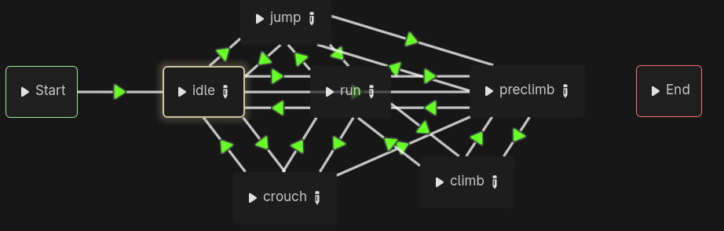

### Latihan Mandiri: Eksplorasi Mekanika Pergerakan

Pada tutorial kali ini, kami diperintahkan untuk menambahkan beeberapa fitur yang umumnya terdapat dalam sebuah game platformer. Dalam project ini, saya mengimplementasikan beberapa hal, yakni:

#### 1. Double Jump

> Double jump berarti player dapat melakukan dua kali lompatan tanpa menyentuh tanah. Fitur ini saya implementasikan dengan membuat sebuah jump_num yang initialnya bernilai 2, yakni sebuah counter dari jump yang sudah dilakukan player. Jika player lompat sekali, maka counter akan berkurang dan kembali ke 2 jika menyentuh tanah. Namun jika player `is_not_on_floor()`, pemain dapat memangaatkan sisa jump_num untuk lompat. Double jump dapat dilakukan dengan menekan `Space` dua kali.

#### 2. Dash
> Dash berarti player mendapatkan boost speed selama beberapa detik. Fitur ini diimplementasikan dengan mengubah kecepatan player untuk beberapa waktu dengan menggunkan timer `dashTimer` dan mengembalikan kecepatannya setelah timer nya habis. Kemudian saya juga mengimplementasikan dash cooldown yang memanfaatkan timer pula (Cooldown berlaku selama 2 detik). Dash dapat dilakukan dengan menekan tombol `shift`

#### 3. Crouch
> Crouch berarti player menjadi lebih kecil dan berjalan lebih lambat. Untuk menggambarkan player yang semakin kecil saat melakukan crouch, saya meng-assign sprite baru ketika crouch dilakukan. Lalu kecepatan player saat crouch juga dikurangi serta saat crouching, player tidak dapat lompat ataupun melakukan dash. Hal ini dilakukan untuk menjaga imersi game dan kegunaan dari crouch itu sendiri. Crouch dapat dilakukan dengan menekan tombol `c`

#### 4. Climb
> Climb atau memanjat berarti player dapat memanjat sebuah tangga yang sudah tersedia di dalam world. Cara saya mengimplementasikannya adalah dengan menggunakan `Area2D` pada tangga sehingga dapat diidentifikasi oleh player. Saat memasuki ladder (belum memanjat), animasi character akan menjadi `preclimb` yang dapat digambarkan sebagai player yang menghadap ke ladder. Setelah preclimb, player dapat memanjat ladder ke atas dan ke bawah. Saat climbing, saya juga menggunakan animasi yang sudah disediakan di spritesheet. Cara untuk melakukan climb adalah dengan masuk dahulu ke area ladder sampai badan character menghadap ke ladder lalu menekan `w` untuk naik dan `s` untuk turun

### Bonus (Non moving-features)
#### 5. AnimationTree
> Pada project ini saya pertama kali menggunakan AnimationTree dalam perancangan animasi dan perubahan state dari character. Menurut saya, penggunaan AnimationTree dalam perancangan animasi sangat dapat dikontrol, namun tidak terlalu intuitif bagi developer yang baru belajar membuatnya. Hal ini dikarenakan seluruh kemungkinan transisi animasi harus dipikirkan. Selain itu dalam script, banyak sekali animasi-animasi yang bergantian di-enable dan di-disable, menambah rasa sulit dan *ribet* dalam penyusunan animasi. Namun kembali lagi, karena sangat detail, maka animasi dan transisinya terasa sangat baik dan imersif.

